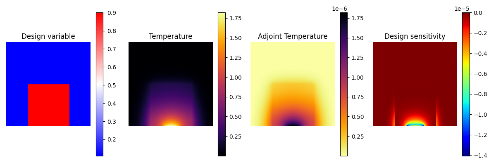
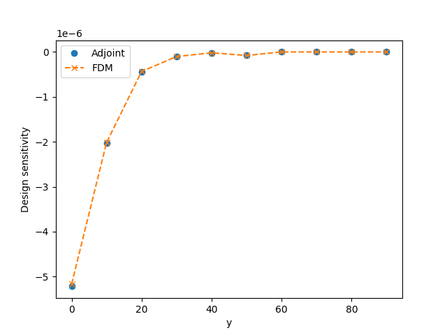

# adjoint-heat-transfer

Lecture notes on the adjoint variable method for heat transfer



## Overview

The adjoint variable method is a highly efficient sensitivity analysis technique and is frequently used in topology optimization. This note explains the formulation and implementation of the adjoint variable method applied to transient heat transfer discretized using the finite volume method.

## Prerequisites

- Install [uv](https://docs.astral.sh/uv/getting-started/installation/)(Python package manager).

## Getting started

1. Clone this repository
    ```shell
    git clone https://github.com/PANFACTORY/adjoint-heat-transfer.git
    cd adjoint-heat-transfer
    ```
2. Install dependencies
    ```shell
    uv sync
    ```
3. Run
    ```shell
    uv run src/adjoint.py
    ```

## Gallery

Run
```shell
uv run src/comparison
```
and you can see the comparison results between the design sensitivity computed by the adjoint variable method and that computed by the finite difference approximation as shown below.



## Notes

- [Finite Volume Method (FVM)](./docs/finite_volume_method.md)
- [Adjoint Variable Method](./docs/discrete_adjoint.md)

## License

[MIT](./LICENSE)
